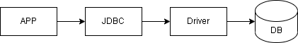
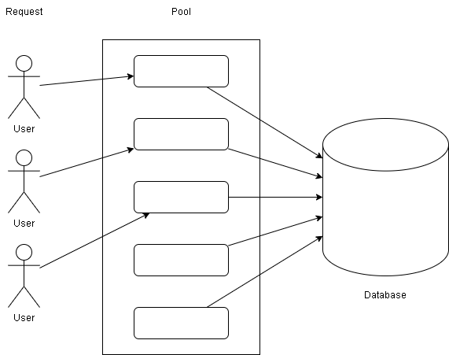

<h1 style="text-align: center;">Java Database</h1>

## Pengenalan JDBC

JDBC (Java Database Connectivity) merupakan spesifikasi API standar untuk mengakses database. Untuk terhubung ke database apapun, cara kerjanya sama dan hanya berbeda query SQL yang digunakan. JDBC hanya berisi interface-interface kontrak untuk berinteraksi dengan database. JDBC perlu implementasi, atau bisa disebut dengan Driver, seperti MySQL Driver, PostgreSQL Driver, OracleDB Driver, dan lain-lain. Semua interface API JDBC terdapat di package `java.sql` dan `javax.sql`.

## Cara Kerja JDBC



Dari aplikasi (APP) yang dibuat menggunakan Java lalu terhubung ke JDBC yang kemudian menggunakan Driver untuk terhubung ke database, tergantung dengan jenis databasenya.

## JUnit 5

Belajar Java Database menggunakan unit test, dengan menambahkan dependency JUnit 5 di project.

Source junit-jupiter di https://search.maven.org/

## Driver

Driver adalah jembatan penghubung antara JDBC dan Database Management System yang akan digunakan. Sebenarnya Driver itu berisikan class-class implementasi dari interface yang terdapat di JDBC. Tanpa menggunakan Driver, JDBC tidak bisa terkoneksi ke DBMS. Driver di JDBC direpresentasikan oleh interface `java.sql.Driver`.

Dokumentasi (Java Doc): https://docs.oracle.com/en/java/javase/17/docs/api/java.sql/java/sql/Driver.html

## PostgreSQL Driver

Untuk menghubungkan aplikasi Java dengan PostgreSQL menggunakan JDBC, kita memerlukan driver PostgreSQL JDBC. Langkah-langkah untuk mengunduh dan menggunakan driver PostgreSQL JDBC:

1. Unduh Driver PostgreSQL JDBC dari situs resmi PostgreSQL atau dari repository Maven. Lihat [sumber](https://jdbc.postgresql.org/download)

2. Tambahkan Driver ke Proyek Java.

   - Menggunakan Maven

     Jika menggunakan Maven untuk manajemen proyek, tambahkan dependensi berikut ke dalam file `pom.xml`:

     ```xml
     <dependency>
         <groupId>org.postgresql</groupId>
         <artifactId>postgresql</artifactId>
         <version>42.7.3</version>
     </dependency>
     ```

     Untuk memeriksa versi terbaru, cek sumber [disini](https://central.sonatype.com/artifact/org.postgresql/postgresql)

   - Menggunakan Gradle

     Jika menggunakan Gradle untuk manajemen proyek, tambahkan dependensi berikut ke dalam file `build.gradle`:

     ```gradle
     dependencies {
         implementation 'org.postgresql:postgresql:42.7.3'
     }
     ```

   - Manual Download

     Jika tidak menggunakan sistem manajemen dependensi seperti Maven atau Gradle, kita bisa mengunduh file `.jar` dari situs resmi dan menambahkannya ke classpath proyek kita.

     - Jalankan IntellJ IDE.
     - Buat atau buka proyek Java.
     - Klik kanan pada nama proyek dan pilih **Open Module Settings**.
     - Setelah itu, pilih **Libraries** pada tab **Project Settings** dan klik **New Project Library (+)**.
     - Kemudian, pilih file PostgreSQL Database Driver seperti `postgresql-42.7.3.jar`.
     - Info lengkap ada [disini](https://postgresqltutorial.com/postgresql-jdbc/connecting-to-postgresql-database)

## Membuat File Konfigurasi Database

Untuk melakukan koneksi ke database, kita harus memberi tahu jenis database, host, post, username, dan password untuk terkoneksi ke database.

Pertama, buat file `db.properties` di dalam direktori `src` proyek. Kemudian, tambahkan parameter koneksi ke dalam file `db.properties`:

```properties
db.url=jdbc:postgresql://localhost:5432/database_name
db.username=your_username
dns.password=your_password
```

`config.properties` mencakup tiga parameter koneksi:

- `db.url`: Tiap database memiliki format jdbc url masing-masing. URL database PostgreSQL. Disini, kita terhubung di server lokal PostgreSQL dengan port 5432 (port default).
- `db.username`: Username yang terhubung ke database.
- `db.password`: Kata sandi pengguna.

## Membuat Connection

Untuk membuat Connection ke database, kita bisa menggunakan static method getConnection() di class java.sql.DriverManager. Semua method di JDBC rata-rata selalu akan menghasilkan SQLException.

Koneksi ke database direpresentasikan oleh interface java.sql.Connection.

- Mendefinisikan class `DatabaseConfig.java` di dalam direktori `src`.

  ```java
  import java.io.IOException;
  import java.io.InputStream;
  import java.util.Properties;

  public class DatabaseConfig {
      private static final Properties properties = new Properties();

      static {
          try (InputStream input = DatabaseConfig.class.getClassLoader().getResourceAsStream("db.properties")) {
              if (input == null) {
                  System.out.println("Sorry, unable to find db.properties");
                  System.exit(1);
              }

              properties.load(input);
          } catch (IOException e) {
              e.printStackTrace();
          }
      }

      public static String getDbUrl() {
          return properties.getProperty("db.url");
      }

      public static String getDbUsername() {
          return properties.getProperty("db.username");
      }

      public static String getDbPassword() {
          return properties.getProperty("db.password");
      }
  }
  ```

  Class `DatabaseConfig` bertanggung jawab untuk memuat konfigurasi database dari `db.properties` file. `DatabaseConfig` memiliki tiga method statis yang me-return konfigurasi database:

  - `getDbUrl()`: Mengembalikan URL database.
  - `getDbUsername()`: Mengembalikan username.
  - `getDbPassword()`: Mengembalikan password.

- Membuat DB class dengan nama `DB.java` dalam direktori `src`. Kemudian definisikan class `DB` seperti kode berikut:

  ```java
  import java.sql.Connection;
  import java.sql.DriverManager;
  import java.sql.SQLException;

  public class DB {
      public static Connection getConnection() throws SQLException {
          try {
              var jdbcUrl = DatabaseConfig.getDbUrl();
              var user = DatabaseConfig.getDbUsername();
              var password = DatabaseConfig.getDbPassword();

              return DriverManager.getConnection(jdbcUrl, user, password);
          } catch (SQLException e) {
              System.err.println(e.getMessage());
              return null;
          }
      }
  }
  ```

  Class `DB` memiliki method statis `connect()`, yang terhubung ke database di server PostgreSQL lokal.

  Method `connect()` menggunakan class `DatabaseConfig` untuk memuat parameter koneksi dan membuat koneksi ke database menggunakan method `getConnection()` dari class `DriverManager`.

  Method `connect()` mengembalikan objek `Connection` jika berhasil membuat koneksi ke PostgreSQL, atau `null` jika tidak. Jika ada `SQLException` yang terjadi selama proses koneksi, method `connect()`akan menampilkan rincian exception.

## Menguji Connection

Buat file `Main.java` di dalam direktori `src`. Kemudian definisikan class `Main` seperti kode berikut:

```java
import java.sql.SQLException;

public class Main {
    public static void main(String[] args) {
        try (var connection = DB.connect()) {
            System.out.println("Connected to the PostgreSQL database.");
        } catch (SQLException e) {
            System.err.println(e.getMessage());
        }
    }
}
```

Method Main() dari class `Main` menggunakan class `DB` untuk menyambung ke database di server PostgreSQL lokal dengan memanggil method `connect()`.

Method ini akan menampilkan pesan jika koneksi berhasil dibuat atau kesalahan jika terjadi SQLException.

Pernyataan `try-with-resources` memastikan bahwa koneksi secara otomatis ditutup meskipun terjadi pengecualian.

Jika kita menjalankan program dan melihat output berikut, artinya program berhasil terhubung ke server PostgreSQL.

`Connected to the PostgreSQL database.`

## Menutup Connection

Saat kita selesai menggunakan Connection, disarankan untuk selalu menutup Connection tersebut. Jika sebuah Connection tidak kita tutup, maka selama aplikasi kita berjalan, koneksi ke database akan selalu terbuka. Jika Connection yang terbuka ke database terlalu banyak, ditakutkan nanti kita tidak bisa membuka koneksi lagi ke database dikarenakan sudah menyentuh nilai maksimum koneksi yang bisa di tangani oleh database-nya.

## Masalah dengan Connection

Connection adalah sebuah resource yang sangat mahal. Jika aplikasi kita sangat ketergantungan dengan database, maka membuka tutup koneksi setiap ada request sangatlah mahal harganya. Connection itu sangat lambat ketika pertama kali dibuat, dan sangat mahal memakan memory. Oleh karena itu, melakukan manajemen Connection secara manual sangatlah tidak direkomendasikan saat nanti kita membuat aplikasi.

## Connection Pool

Connection Pool adalah konsep dimana dibanding kita membuat koneksi baru setiap ada request ke yang membutuhkan database. Lebih baik diawal kita buatkan banyak Connection terlebih dahulu, sehingga hanya lambat diawal ketika aplikasi berjalan. Selanjutnya ketika ada request yang butuh koneksi, kita hanya cukup menggunakan salah satu Connection, dan setelah selesai, kita kembalikan lagi Connection-nya.

Jika semua Connection sedang terpakai semua, ketika ada request yang butuh koneksi lagi, request tersebut diminta untuk menunggu terlebih dahulu, dengan demikian penggunaan memory untuk Connection tidak akan terlalu bengkak. Connection Pool di JDBC direpresentasikan dengan interface `javax.sql.DataSource`.



Setiap user akan meminjam Connection ke Connection Pool untuk terhubung ke Database. Jika user selesai menggunakan Connection, maka Connection tersebut akan dikembalikan ke Connection Pool.

## HikariCP

Membuat connection pool secara manual bukanlah hal bijak, lebih baik kita menggunakan library connection pool yang sudah terbukti bekerjja dengan baik. HikariCP adalah salah satu connection pool library yang paling populer saat ini di Java. Kita bisa menggunakan HikariCP untuk melakukan connection pool terhadap koneksi database di aplikasi kita. HikariCP memanfaatkan [PoolDataSource](https://github.com/brettwooldridge/HikariCP) untuk membuat koneksi ke database.

## Konfigurasi HikariCP

```java
HikariConfig config = new HikariConfig();
config.setJdbcUrl("jdbc:postgresql://localhost:5432/database_name?serverTimezone=Asia/Jakarta");
config.setUsername("your_username");
config.setPassword("your_password");

config.setMaximumPoolSize(10);
config.setMinimumIdle(5);
config.setIdleTimeout(60_000);
config.setMaxLifetime(10 * 60_000);
```

## Membuat Connection Pool

```java
HikariDataSource dataSource = new HikariDataSource(config);

Connection conn = null;
Statement stmt = null;

try {
    conn = dataSource.getConnection();
    System.out.println("Connected to the PostgreSQL database successfully.");

    stmt = conn.createStatement();
    String sql = "SELECT * FROM table_name";
    ResultSet rs = stmt.executeQuery(sql);

    while (rs.next()) {
        int id = rs.getInt("id");
        String name = rs.getString("name");
        System.out.println("ID: " + id + ", Name: " + name);
    }

    rs.close();
    stmt.close();
    conn.close();
} catch (Exception e) {
    e.printStackTrace();
} finally {
    try {
        if (stmt != null) stmt.close();
        if (conn != null) conn.close();
        if (dataSource != null) dataSource.close();
    } catch (Exception ex) {
        ex.printStackTrace();
    }
}
```

## Mengirim Perintah SQL

Saat kita terkoneksi ke database via Connection, sudah pasti kita ingin mengirim perintah SQL ke database. Connection adalah object yang bertugas sebagai jembatan koneksi dari aplikasi ke database. Untuk melakukan perintah SQL ke database, kita bisa menggunakan interface `java.sql.Statement`.

## Statement

Statement di JDBC direpresentasikan dengan interface `java.sql.Statement` yang bisa digunakan untuk mengirim SQL ke database sekaligus menerima response data dari database. Ada banyak method yang bisa kita gunakan di interface `java.sql.Statement`. Untuk lengkapnya dapat dilihat pada [dokumentasi](https://docs.oracle.com/en/java/javase/17/docs/api/java.sql/java/sql/Statement.html).

Setiap jenis statement memiliki kegunaan yang berbeda dan dioptimalkan untuk berbagai jenis operasi database.

1. Statement: digunakan untuk mengeksekusi perintah SQL sederhana tanpa parameter, cocok untuk menjalankan query yang tidak memerlukan parameterisasi.

   ```java
   import java.sql.Connection;
   import java.sql.Statement;
   import java.sql.DriverManager;
   import java.sql.ResultSet;

   public class StatementExample {
       public static void main(String[] args) {
           String url = "jdbc:postgresql://localhost:5432/database_name";
           String username = "your_username";
           String password = "your_password";

           try (Connection conn = DriverManager.getConnection(url, username, password);
               Statement stmt = conn.createStatement()) {

               String query = "SELECT * FROM table_name";
               ResultSet rs = stmt.executeQuery(query);

               while (rs.next()) {
                   int id = rs.getInt("id");
                   String name = rs.getString("name");
                   System.out.println("ID: " + id + ", Name: " + name);
               }

               rs.close();
           } catch (Exception e) {
               e.printStackTrace();
           }
       }
   }
   ```

2. PreparedStatement: digunakan untuk mengeksekusi perintah SQL yang memerlukan parameterisasi. Statement jenis ini lebih aman terhadap SQL Injection dan lebih efisien untuk eksekusi query berulang.

3. CallableStatement: digunakan untuk mengeksekusi stored procedures yang disimpan di dalam database. CallableStatement memungkinkan kita untuk menjalankan logika bisnis yang lebih kompleks di sisi database.

## ResultSet

`ResultSet` di JDBC direpresentasikan dengan interface `java.sql.ResultSet` yang bisa digunakan untuk menangani hasil dari query SQL yang dijalankan melalui objek `Statement`, `PreparedStatement`, dan `CallableStatement`. `ResultSet` menyimpan data yang dikembalikan oleh query dan memungkinkan kita untuk membaca dan memproses data tersebut.

Kita dapat menavigasi melalui baris-baris data dalam `ResultSet` dengan menggunakan method `next()`, `previous()`, `first()`, dan `last()`. Method `next()` mengembalikan `true` jika ada baris yang dapat ditangani, dan `false` jika tidak.

Data dalam `ResultSet` dapat diambil menggunakan metode getter yang sesuai dengan tipe data kolom, seperti `getInt()`, `getString()`, dan lain-lain. Kita bisa mengambil data berdasarkan indeks kolom (dimulai dari 1) atau nama kolom.

## Source:

- [Programmer Zaman Now](https://github.com/ProgrammerZamanNow)
